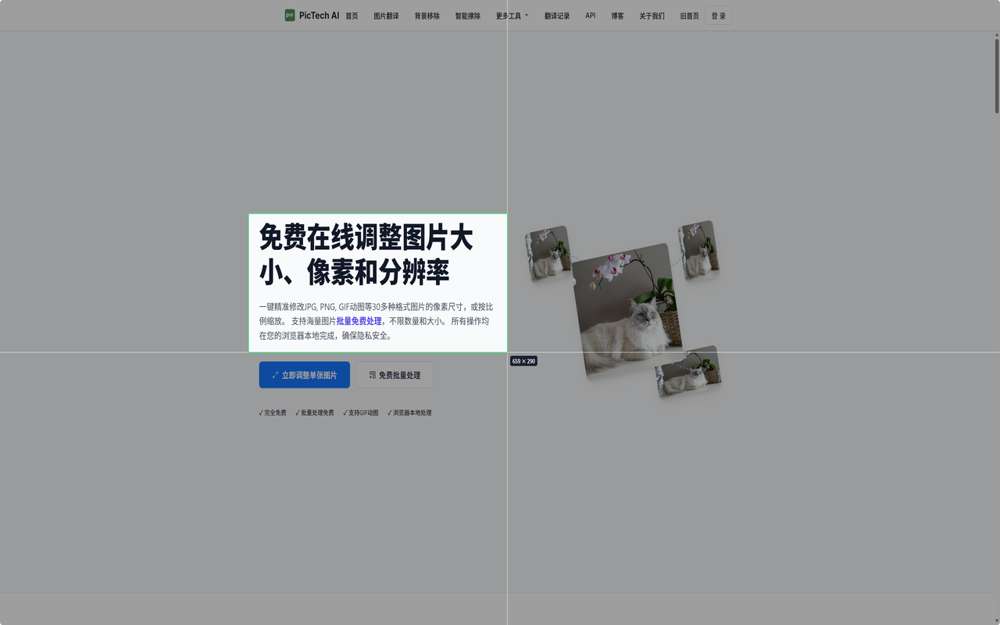
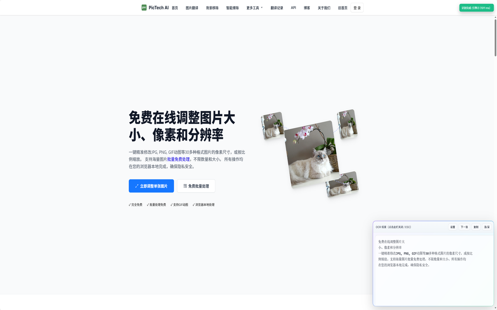

#  OCR Box

一个轻量级、双引擎驱动的浏览器截图 OCR 扩展。集成了稳定的 [OCR.space](https://ocr.space/) 服务与实验性的百度云加速通道。

\<table\>
  \<tr\>
    \<td align="center"\>\<b\>选项页面\</b\> (双引擎切换)\</td\>
    \<td align="center"\>\<b\>截图操作\</b\> (精准框选)\</td\>
    \<td align="center"\>\<b\>识别结果\</b\> (秒级响应)\</td\>
  \</tr\>
  \<tr\>
    \<td\>\\</td\>
    \<td\>\\</td\>
    \<td\>\\</td\>
  \</tr\>
\</table\>

-----

## ✨ 功能特性

### 🚀 双模引擎 (New\!)

本插件现已支持两种识别模式，您可以在选项页自由切换：

1.  **🚀 百度极速版 (推荐)**：
      * **免配置**：无需注册或申请 API Key，开箱即用。
      * **极速响应**：基于百度云高精度接口，识别速度快，准确率极高。
      * **无限次**：目前处于**公测阶段**，暂无每日额度限制。
2.  **🛡️ OCR.space 标准版**：
      * **稳定可靠**：使用官方标准 API，适合对隐私有极高要求的用户。
      * **完全掌控**：使用您个人的 API Key，额度与您的账户绑定。

### 🛠️ 核心功能

  * **⚡️ 快速截图**：按下快捷键或点击图标，即可像微信截图一样（四周暗化）选取屏幕区域。
  * **🤖 智能备援**：在 OCR.space 模式下，支持自动从“引擎2”故障切换至“引擎1”。
  * **🎨 现代化交互**：
      * **下一张**：识别完成后可直接开始下一次截图，无需关闭窗口。
      * **一键复制**：快速复制识别结果到剪贴板。
      * **深色模式**：自适应的浅色/深色 UI 主题。

-----

## 📦 安装

### 1\. (推荐) 从 Edge 扩展商店安装

1.  前往 Microsoft Edge 扩展商店。
2.  搜索 "OCR Box"。
3.  点击“获取”按钮。

*[(商店链接)](https://microsoftedge.microsoft.com/addons/detail/ocr-box/pblfahjdheanodpnjafdefodiijmfbmf?hl=zh-CN)*

### 2\. (开发版) 本地加载

1.  下载本仓库的 `.zip` 文件并解压。
2.  打开浏览器扩展管理页 (`edge://extensions/` 或 `chrome://extensions/`)。
3.  开启“**开发人员模式**”。
4.  点击“**加载已解压缩的扩展**”，选择解压后的文件夹。

-----

## ⚙️ 设置指南

### 方式一：使用百度极速版 (默认)

**无需任何设置！** 插件默认已启用此模式。安装后直接按下快捷键 (`Alt` + `0`) 即可开始识别。

### 方式二：使用 OCR.space 版

如果您希望使用自己的 API Key：

1.  右键插件图标 -\> **“选项”**。
2.  在“OCR 引擎设置”中选择 **“OCR.space 自动”**。
3.  前往 [OCR.space 官网](https://ocr.space/ocrapi/freekey) 申请免费 Key。
4.  将 Key 填入下方输入框并保存。

-----

## ⚠️ 免责声明 (Disclaimer)

1.  **服务可用性**：
    “百度极速版”功能基于公开的云端加速接口实现。该接口属于**实验性测试通道**，我们无法保证其永久可用性。如果该通道失效，建议您切换回稳定的 OCR.space 模式使用。

2.  **数据处理**：
    本插件仅作为浏览器端的连接工具。在“百度极速版”模式下，图片数据将直接传输至百度云接口进行处理；在“OCR.space”模式下，数据传输至 OCR.space 服务器。插件本身**不会保存、收集或泄露**您的任何截图内容或识别结果。

3.  **合规使用**：
    本工具仅供个人学习、研究和提高工作效率使用。请勿利用本工具识别、传播任何违反法律法规的文字信息。

-----

## 📄 许可证

本项目基于 [MIT](https://www.google.com/search?q=LICENSE) 许可证开源。